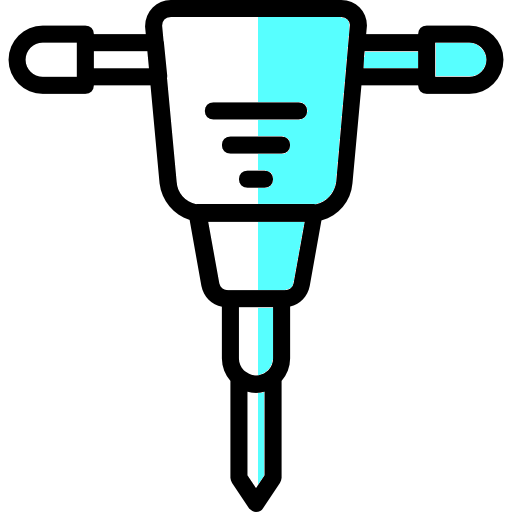

# kubectl dig

> Deep kubernetes visibility from the kubectl.

<table style="width: 100%; border-style: none;"><tr>
<td style="width: 140px; text-align: center;"></td>
<td>
<strong>kubectl dig</strong><br />
<i>A simple, intuitive, and fully customizable UI to dig into your kubernetes clusters</i><br>

```
kubectl dig <node>
```
</td>
</tr></table>

[](https://asciinema.org/a/czA06tSyEjKpusDooKZe3KQry)

## Install


```bash
go get -u github.com/sysdiglabs/kubectl-dig/cmd/kubectl-dig
```

## Usage

### Just dig
There's only one thing to do, provide the node name!

```
kubectl dig <node>
```

You just identify the node you want to dig in with `kubectl get nodes` and then
provide it to the dig command!

```
kubectl dig ip-180-12-0-152.ec2.internal
```

### dig + cluster metadata

By default, `kubectl dig` shows only information about the local node, if you want to dig from that node to the whole cluster you have to provide a **service account** that can read resources.

You can create a `dig-viewer` service account with:

```bash
kubectl apply -f https://github.com/sysdiglabs/kubectl-dig/raw/develop/docs/setup/read-serviceaccount.yml
```

Then you just use it with `kubectl dig`.

```bash
kubectl dig --serviceaccount dig-viewer 127.0.0.1
```

At this point you have access to the fancy cluster metadata, press `F2` and look for the `K8s` views!


# Project status

## High-level todo

- [x] Basic functionalities;
- [ ] Finish all the planned commands;
- [ ] Merge here the functionalities of [kubectl-capture](https://github.com/sysdiglabs/kubectl-capture);
- [ ] Integration tests;
- [ ] Errors detection on the kernel module;

## Planned commands

- [x] `run` command, to execute digs;
- [ ] `list` command, to list all the executed digs;
- [ ] `attach` command, to attach to an existing dig that was previously detached;
- [ ] `delete` command, to delete an existing dig;
- [ ] `where` command, to execute digs where the chosen workloads are, instead of having to specify the node directly;


---

[](https://github.com/igrigorik/ga-beacon)

